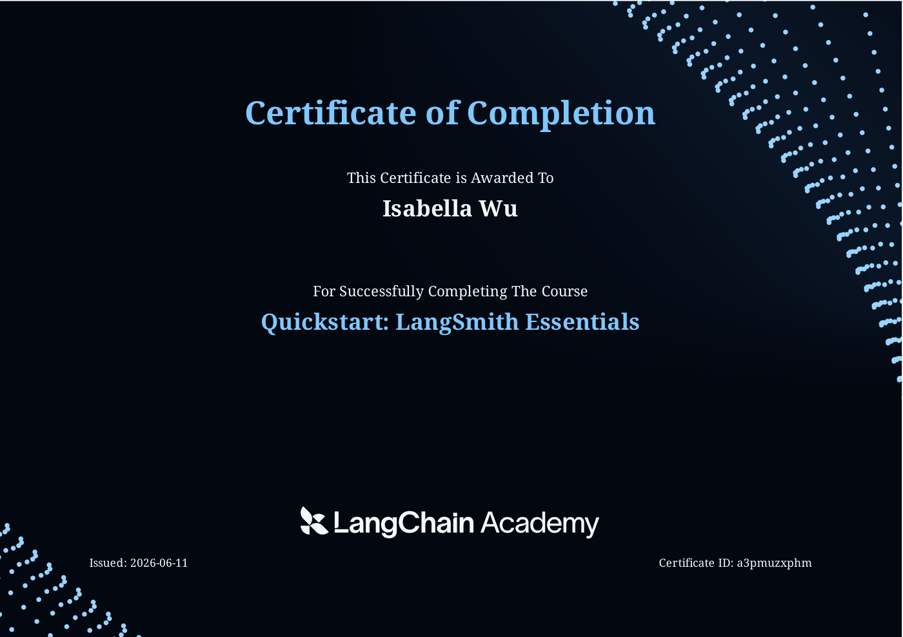
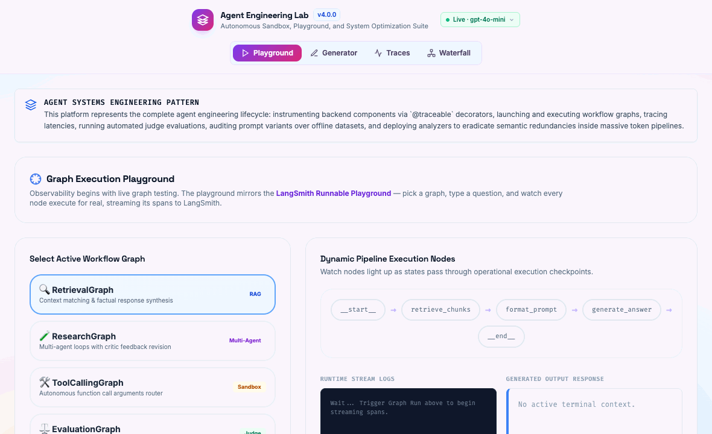
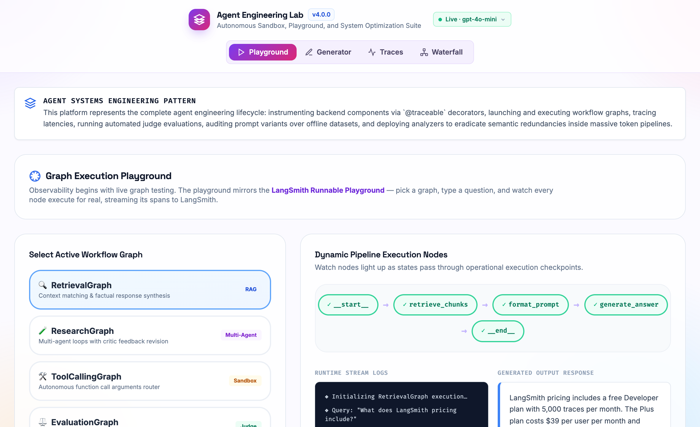

# Agent Engineering Lab

A small, **real** playground for learning LLM observability with [LangSmith](https://smith.langchain.com/).

It used to be a single static HTML file full of hardcoded mock data. Now it has a tiny
Node backend that makes **genuine OpenAI calls**, instruments them with the **LangSmith
SDK**, and feeds the existing UI with real traces — real token counts, real cost, real
latency, real retrieval, and real LLM-as-a-judge scores.

## Background

This project is a hands-on **extension of what I learned in [LangChain Academy](https://academy.langchain.com/)** —
specifically the *Quickstart: LangSmith Essentials* course. The course covers tracing,
spans, evaluation, and LLM observability concepts; this lab puts those ideas into a working
app where you can actually run agent graphs and watch the traces they produce.

[](assets/langsmith-certificate.pdf)

> *Certificate of Completion — "Quickstart: LangSmith Essentials," LangChain Academy.
> [View PDF](assets/langsmith-certificate.pdf).*

## Real example

A live `RetrievalGraph` run — embeds the question, retrieves matching docs, and answers
from them. The pipeline nodes light up as the run streams, then the grounded answer appears
(real OpenAI call, captured as a LangSmith trace):





> Captured from an actual run against the OpenAI + LangSmith APIs. Regenerate anytime with
> `npm run demo` (needs the server running on :3000 with a working key).

## What's real now

- **Playground** — runs one of four real agent graphs end to end:
  - `RetrievalGraph` — embeds a small knowledge base, ranks chunks by cosine similarity, answers with citations.
  - `ResearchGraph` — plan → draft → self-critique/revision (a real reflection loop).
  - `ToolCallingGraph` — OpenAI function calling drives a sandboxed calculator, then composes the answer.
  - `EvaluationGraph` — generates an answer, then scores it with an LLM judge (returns JSON).
- **Generator** — a configurable pipeline (toggle planner / retriever / tool / evaluator) that runs for real and writes a trace.
- **Trace Explorer / Waterfall** — populated by the traces your runs produce. Each run is also sent to LangSmith.
- **Sync from LangSmith** (Trace Explorer footer) — pulls your real run history back from the LangSmith API; selecting one lazily loads its full span tree.

The header pill shows live backend status (model, LangSmith on/off).

## Setup

Requires Node 18+.

```bash
npm install
cp .env.example .env      # then edit .env with your keys
npm start                 # serves http://localhost:3000
```

### Keys (`.env`)

| Variable | Required | Notes |
| --- | --- | --- |
| `OPENAI_API_KEY` | **yes** | The app errors clearly without it. |
| `LANGSMITH_API_KEY` | recommended | Enables real tracing + "Sync from LangSmith". |
| `LANGSMITH_TRACING` | `true` to trace | Set `false` to disable tracing without removing the key. |
| `LANGSMITH_PROJECT` | optional | Project traces land in (default `agent-engineering-lab`). |
| `OPENAI_MODEL` | optional | Default `gpt-4o-mini`. |
| `PORT` | optional | Default `3000`. |

Open http://localhost:3000, go to **Playground**, pick a graph, and hit run. Then open your
LangSmith project to see the same trace captured server-side.

## Deploy (Render)

This is a Node web app (it serves the UI **and** the API), so it needs a Node host — not a
static-only host. A [`render.yaml`](render.yaml) Blueprint is included:

1. [render.com](https://render.com) → **New +** → **Blueprint** → pick this repo.
2. Render reads `render.yaml` and prompts for the two secrets: **`OPENAI_API_KEY`** and
   **`LANGSMITH_API_KEY`** (paste them; they're never stored in the repo).
3. Deploy. Build runs `npm install --omit=dev`, start runs `npm start`, and the server binds
   to Render's `PORT` automatically.

> ⚠️ **Cost/security:** if you set `OPENAI_API_KEY` on a public deployment, anyone with the URL
> can run agents on your key and spend your credits. Either leave the server key unset and let
> visitors enter their own key via the in-app key panel, put the app behind auth, or keep it
> private. Other Node hosts (Railway, Fly.io) work the same way — same build/start/env vars.

## How it fits together

```
agent_engineering_lab.html   UI (calls /api/* instead of using mock data)
        │  fetch
server.js                     Express: /api/run, /api/config, /api/traces[/:id]
        │
graphs.js                     Real graphs: OpenAI (wrapOpenAI) + traceable spans
        │
   OpenAI API  +  LangSmith
```

Each graph step is wrapped in LangSmith's `traceable`, and the OpenAI client is wrapped with
`wrapOpenAI`, so token usage and latency are captured automatically and the run shows up as a
nested trace in LangSmith — exactly the workflow this lab is meant to teach.

## Navigation

The app opens on the **Playground** and keeps four tabs, all backed by the live server:
Playground · Generator · Traces · Waterfall.

The older static/illustrative tabs (Instrumentation, Retrieval Inspector, Evaluation Center,
Prompt Optimization, Response Efficiency, Insights) were removed from the nav to keep things
focused — their markup still lives in the HTML (hidden) if you ever want to wire them up and
bring them back. The Traces tab also ships with a few seed example traces so the views aren't
empty before your first run.
